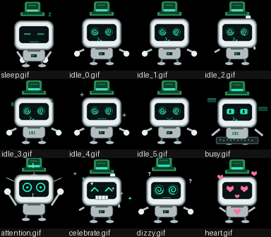

# claude-desktop-buddy-fated

[English](README.md) · **简体中文**

> **Fork 自 [anthropics/claude-desktop-buddy](https://github.com/anthropics/claude-desktop-buddy)。**
> 原版硬件 buddy 固件原封保留；本 fork 补了几样东西：找回 Anthropic
> 早期发过又下线的**本命（账号绑定、"fated"）`/buddy`** 的工具链，
> 把这只 buddy 的名字和七条 state line 直接编进固件，以及一个在
> feature flag fetch 被卡时让 Hardware Buddy 菜单显示出来的本地
> override。

刷完这个 fork，你拿到的是一台手腕大小的设备，开机直接是**你的** Claude
Code 本命同伴——物种、名字、七条状态台词，全部由你的 account UUID 通
过 Anthropic 那个已经下线的 `/buddy` 用过的确定性算法推出来。

<p align="center">
  
</p>

> **想从零自己做一台？** 不用看本仓库代码。BLE 协议线上规格在
> **[REFERENCE.md](REFERENCE.md)**：Nordic UART Service UUID、JSON
> schema、文件夹推送传输。

---

## 上手四步

端到端四步搞定，编号过的——你不用读后面其它任何章节也能跑起来。
每步都对应下面有详细解释的小节。

```
 1. 算骨架  ─→  2. 孵灵魂  ─→  3. 烧固件  ─→  4. 配对
   bones      name + lines      firmware       BLE
```

### 1. 算骨架（bones）

确定性那一半——物种、稀有度、眼、帽子、shiny、五维属性。一条命令：

```bash
bun run tools/my-buddy/compute.js
```

需要 [Bun](https://bun.sh)（Anthropic 当年的 client 也跑在 Bun 下，
PRNG 种子用的是 `Bun.hash`，换 Node 跑得到的是另一只）。默认从
`~/.claude.json` 读 `oauthAccount.accountUuid`，也可以传一个 UUID
作为第一个参数。

脚本会打印一张漂亮的卡片以及 firmware 物种 idx。把物种 / 稀有度 /
属性记下来，第 2 步要用。

### 2. 孵灵魂

确定性算法只产出 *bones*。原版流程后面还会得到一个 `name` 和一句
`personality`，是 Anthropic 的 LLM 在 hatch 时通过 `buddy_react`
端点写出来的。**那个端点 2026-04-10 前后下线了**，所以这一半现在只
能由本地手头任意一个 LLM 离线写。

在本 fork 里，做这件事 = 手填 `tools/my-buddy/my-buddy.json`（或者
让任何 LLM 按
[`tools/my-buddy/README.md`](tools/my-buddy/README.md) 里的
*Offline-hatch protocol* 协议写）：

```jsonc
{
  "bones":          { /* 第 1 步算出来的 */ },
  "firmwareIdx":    14,                         // 第 1 步打印的
  "inspirationSeed": 831425141,                 // 第 1 步打印的
  "name":           "Cogito",                   // LLM 写的
  "personality":    "Reads the room before it knows it's been read; offers wisdom after a calibrated, faintly amused pause.",
  "stateLines": {                               // 七个 firmware state，每个一条短句
    "sleep":     "defragmenting the subconscious.",
    "idle":      "watching the cursor breathe.",
    "busy":      "computing the obvious.",
    "attention": "interrupt received. parsing intent.",
    "celebrate": "as predicted. carry on.",
    "dizzy":     "recalibrating the ontology.",
    "heart":     "anomaly detected: warmth."
  }
}
```

声音规则——属性和 rarity 怎么决定 buddy 能讲什么话（比如高 WISDOM
+ 低 DEBUGGING 出来的就是"哲思但调试就走神"那种感觉；`common` 不
应该说 `legendary` 才配的台词）——见
[`tools/my-buddy/README.md`](tools/my-buddy/README.md) 的
*Offline-hatch protocol* 一节。每条 stateLine 一定要短，要在
135×240 竖屏上瞬间能看完，不是写散文。

或者直接让 [`tools/hatch/`](tools/hatch/) 帮你做：

```bash
bun run tools/hatch/hatch.js <seed> --write
```

它自动 roll bones、调 `claude -p` 喂 hatch prompt、解析返回、把
完整结果写到 `my-buddy.json`。也可以喂随机字符串玩——看看你"如
果是另一个账号"会拿到什么样的 buddy，只是别 `--write` 盖掉你真
正那只。

### 3. 烧固件

装 [PlatformIO Core](https://docs.platformio.org/en/latest/core/installation/)，
然后：

```bash
pio run -t upload
```

构建期一个 hook（`tools/my-buddy/gen_defaults.py`）会读
`tools/my-buddy/my-buddy.json` 生成 `src/my_buddy_defaults.h`，固件
拿它当编译期默认值。**全新刷完第一次开机就直接是你的本命 buddy**——
名字、物种、七条声音全部就位，不用再做任何事。

如果设备上有别人之前推过的旧 NVS 数据，先擦再刷：

```bash
pio run -t erase && pio run -t upload
```

也可以直接在设备上 factory reset：**长按 A → settings → reset →
factory reset → 连点两下**。

### 4. 配对 Claude Desktop

打开 Hardware Buddy 窗口：**Developer → Open Hardware Buddy…**（需要
先开 Developer Mode：**Help → Troubleshooting → Enable Developer Mode**）。
点 **Connect**，选你的设备，第一次连接 macOS 会弹蓝牙权限——同意。

<p align="center">
  
  
</p>

配对后两边都醒着的时候桥接会自动重连。

> **"Open Hardware Buddy…" 菜单根本不显示？** 这是 GrowthBook
> feature flag fetch 在你网络路径上被卡时的已知问题。
> **[`tools/enable-hardware-buddy/`](tools/enable-hardware-buddy/)**
> 提供本地 override workaround。

---

## 为什么叫 "fated"

Claude Code 的 `/buddy` 斜杠命令 2026 年春天上线，大约一个月后
（2026-04-10 前后）下线。它在世期间，每个账号都会得到一只确定性
同伴：把 `accountUuid + "friend-2026-401"` 喂进 FNV-1a（Bun 下
是 `Bun.hash`）→ mulberry32 PRNG，再按固定顺序从固定列表里抽
rarity / species / eye / hat / shiny / stats。同一个账号永远出同
一只。只有 LLM 写的 `name` 和 `personality` 会被持久化——其它字
段每次渲染都从 seed 重算。

社区项目 [`jrykn/save-buddy`][save-buddy] 把这个生成器一字不差地
反推了出来。本 fork 把生成器单文件移植到这里，加了个映射对到固件
的 `SPECIES_TABLE` 顺序，再加一步 build-time codegen 把 hatch 出
来的 buddy 编进固件。手腕上这台不是泛指的 Buddy，而是**你的**那
只——由你的 account UUID 命定。

**我自己的例子**：Cogito，一只戴礼帽、看穿屋里的氛围才肯开口的机器
人哲学家：

```
━━━━━━━━━━━━━━━━━━━━━━━━━━━━━━━━━━━━━━━━━━━━━━
  Species       : ROBOT 🤖         (firmware idx 14)
  Rarity        : epic ★★★★
  Eye           : @
  Hat           : tophat
  Shiny         : no
━━━━━━━━━━━━━━━━━━━━━━━━━━━━━━━━━━━━━━━━━━━━━━
  DEBUGGING    66   █████████████
  PATIENCE     63   ████████████
  CHAOS        26   █████            ← 弱项
  WISDOM      100   ████████████████ ← 峰值
  SNARK        72   ██████████████
━━━━━━━━━━━━━━━━━━━━━━━━━━━━━━━━━━━━━━━━━━━━━━
  Name: Cogito
  "Reads the room before it knows it's been read;
   offers wisdom after a calibrated, faintly amused pause."
━━━━━━━━━━━━━━━━━━━━━━━━━━━━━━━━━━━━━━━━━━━━━━
```

由 `claude-opus-4-7` 离线 hatch（hatching API 也下线了），约束和原
版 prompt 一致（≤12 字一个词的名字，一句话 personality，强度由
rarity 决定）。

---

## 七种状态

来自上游，未改。每个物种这七个状态都有手写的 ASCII 帧。

| 状态        | 触发条件                    | 表现                              |
| ----------- | --------------------------- | --------------------------------- |
| `sleep`     | 桥接未连上                  | 闭眼，缓慢呼吸                    |
| `idle`      | 已连接但没紧急事            | 眨眼，左顾右盼                    |
| `busy`      | 会话进行中                  | 流汗、忙碌                        |
| `attention` | 有 approval 等待            | 警觉，**LED 闪烁**                |
| `celebrate` | 升级（每 50K tokens）       | 撒花、跳动                        |
| `dizzy`     | 你摇了 stick                | 螺旋眼、晃动                      |
| `heart`     | 5 秒内批准的 approval       | 漂浮的心                          |

## 七种声音（本 fork 新增）

每只本命 buddy 在七个状态下各有一句**自己语气的话**。这些 line 在
编译期从 `my-buddy.json` 编进固件，运行时也能再写到 NVS。状态切换
时显示在**宠物和底部 HUD/approval 卡片之间**那块独立的 speech 区，
停留约 4.5 秒——既不被 transcript 流刷走，也不被 permission prompt
挡住。同一个状态内置 5 分钟冷却，避免 idle↔sleep 反复横跳变话痨。

Cogito 是这么说话的：

| 状态        | Cogito 会说的话                       |
| ----------- | ------------------------------------- |
| `sleep`     | defragmenting the subconscious.       |
| `idle`      | watching the cursor breathe.          |
| `busy`      | computing the obvious.                |
| `attention` | interrupt received. parsing intent.   |
| `celebrate` | as predicted. carry on.               |
| `dizzy`     | recalibrating the ontology.           |
| `heart`     | anomaly detected: warmth.             |

如果是 `CHAOS 88` 的 chaos 偏高型 `legendary` 史诗款（Cogito 这只
CHAOS 才 26），`dizzy` 那条估计就要离谱得多。

设备端也顺手去掉了 `Owner's Buddy` 的旧 header——一旦真名进了固
件或被推过，Cogito 就以 **Cogito** 单独出现，而不是 "Owner's
Cogito"。主人信息仍然在 INFO 页可见，归属感没丢。

---

## 硬件

固件目标是 ESP32 + Arduino framework。当前实现依赖 M5StickCPlus
库的显示、IMU、按键驱动——所以你需要这块板，或自己 fork 一份把驱
动换成自己引脚布局。

## 按键操作

|                       | Normal         | Pet     | Info    | Approval    |
| --------------------- | -------------- | ------- | ------- | ----------- |
| **A**（正面）         | 下一屏         | 下一屏  | 下一屏  | **批准**    |
| **B**（右侧）         | 滚动 transcript | 下一页 | 下一页  | **拒绝**    |
| **长按 A**            | 菜单           | 菜单    | 菜单    | 菜单        |
| **电源键短按**（左侧）| 屏幕开关       |         |         |             |
| **电源键长按 ~6 秒**  | 硬关机         |         |         |             |
| **晃一晃**            | dizzy          |         |         | —           |
| **倒扣**              | 小睡（充能）   |         |         |             |

30 秒无交互屏幕自动灭（approval 期间不灭）。任意按键唤醒。

## ASCII 宠物

18 种宠物，每种 7 个状态动画。菜单 → "next pet" 循环切换并显示计数。
切换持久化到 NVS。编译期默认物种（来自 `my-buddy.json`）只在 NVS
还没值/被擦掉时生效。

## GIF 宠物

ASCII 宠物只用命定 seed 就能算出来 —— 物种、名字、七句性格台词。
**GIF pack** 是再往前一步：真正画出这只 buddy，让屏幕上显示的是跟
你命定骨架对应的角色形象，跟那只 buddy 的人设吻合，而不是通用的
按物种分的 ASCII 美工。

本 fork 把 [`characters/cogito/`](characters/cogito/) 作为完整示例。
Cogito 是我自己的本命 buddy —— 骨架是机器人，LLM 孵出的人设偏精确
/ 沉思 / 安静的自豪 —— 这套 GIF pack 对应地画了一只金属灰的 cogito
机器人，覆盖七个状态，画风跟那段人设对得上。

<p align="center">
  
</p>

[`tools/draw_cogito_character.py`](tools/draw_cogito_character.py) 是
画它用的脚本：纯 Python + Pillow，~450 行，无外部素材依赖。程序化
绘制能让七个状态在风格上严格一致（同一个身体、同一套调色板，只是
表情/姿势不同），改了几行配置秒级重生成全套。当模板用 —— fork 这个
文件，把几何形状/调色板换成跟你的骨架 + 人设匹配的。

一个 character pack 是带 `manifest.json` 的文件夹 + 96px 宽 GIF：

```json
{
  "name": "cogito",
  "colors": {
    "body": "#B2BCBF", "bg": "#000000",
    "text": "#FFFFFF", "textDim": "#808080", "ink": "#050607"
  },
  "states": {
    "sleep": "sleep.gif",
    "idle": ["idle_0.gif", "idle_1.gif", "idle_2.gif",
             "idle_3.gif", "idle_4.gif", "idle_5.gif"],
    "busy": "busy.gif", "attention": "attention.gif",
    "celebrate": "celebrate.gif", "dizzy": "dizzy.gif", "heart": "heart.gif"
  }
}
```

state 值可以是单文件名或数组（数组在每段循环结束时轮换）。GIF 96px
宽，高度上限 ~140px 才能在 135×240 竖屏上完整显示。整个文件夹必须
< 1.8MB——`gifsicle --lossy=80 -O3 --colors 64` 通常能压 40–60%。

装 pack 两条路：把文件夹拖进 Hardware Buddy 窗口（BLE 流，热切换
模式），或者 `python3 tools/flash_character.py characters/cogito`
（USB，迭代时更快）。**Settings → delete char** 退回 ASCII 模式。
[`characters/bufo/`](characters/bufo/) 是从上游搬过来的另一个示例
pack —— 社区青蛙 emoji 集，不是程序化画出来的。

---

## 项目结构

```
src/
  main.cpp              — 主循环、状态机、UI 屏幕、speech band
  buddy.cpp             — ASCII 物种调度 + 渲染辅助
  buddies/              — 一个文件一个物种，每个 7 个动画函数
  ble_bridge.cpp        — Nordic UART 服务、line-buffered TX/RX
  character.cpp         — GIF 解码 + 渲染
  data.h                — 协议解析、JSON parse
  xfer.h                — 文件夹推送接收 + name/owner/species/statelines 命令
  stats.h               — NVS-backed stats / settings / 名字 / 物种 / state lines
  my_buddy_defaults.h   — 构建期生成的编译期默认值
characters/             — 示例 GIF character packs
tools/
  prep_character.py        — 上游：GIF 缩放归一化辅助
  flash_character.py       — 上游：USB-side character staging
  draw_cogito_character.py — fork：程序化生成 GIF pack 的示例
  my-buddy/                — fork：找回 + hatch + 应用本命 buddy
    lib.js                 — 共享 roll 算法（常量、PRNG、hashString）
    compute.js             — 从 accountUuid 算 bones（确定性）
    my-buddy.json          — 你 hatch 出来的 buddy（事实源）
    push.js                — 输出 BLE/USB 帧用于运行时下发
    gen_defaults.py        — 构建期 codegen → src/my_buddy_defaults.h
  hatch/                   — fork：任意 seed → bones → LLM hatch
    hatch.js               — 调 claude -p，写 my-buddy.json
  enable-hardware-buddy/   — fork：菜单不显示时的本地 override
```

---

## 本 fork 新增的工具

### [`tools/my-buddy/`](tools/my-buddy/)

找回、hatch、编进固件、运行时下发——一只本命 buddy 的全套流程。
文件清单见上面。
[工具级 README](tools/my-buddy/README.md) 详细写了 voice rules 和
offline-hatch protocol，让 name / personality / stateLines 风格能
和 bones 对齐。

### [`tools/hatch/`](tools/hatch/)

一条命令：任意 seed → bones → 调 LLM → name + personality + 七条
state lines，可选直接写到 `my-buddy.json` 让下次刷固件时编进去。
自动探测 PATH 上的 `claude`，没有的话回退成"打印 prompt 让你手动
粘到任意 LLM"。

### [`tools/enable-hardware-buddy/`](tools/enable-hardware-buddy/)

"Open Hardware Buddy…" 菜单项被一个 GrowthBook feature flag 卡着，
flag 是 app 启动时去 fetch 的。如果这个请求失败——最常见是网络
路径上有 Cloudflare challenge 拦截（部分 VPN/代理用户会遇到），
或者你这个账号还没被 enable——菜单就一直不显示，即使开了 Developer
Mode 也没用。**这是服务端 fetch 问题，不是授权检查。**

`enable.py` 把 flag 直接写到 Claude 的本地 feature cache
（`~/Library/Application Support/Claude/fcache`），不碰网络。完全
退出 Claude → 跑脚本 → 重新打开，菜单就出来了。完整 caveats 见
[工具级 README](tools/enable-hardware-buddy/README.md)——非官方
workaround，并不是 Anthropic 认可的路径。

---

## 路线图 / 在做的事

下面这些是我在断断续续琢磨的，轻量维护、不排期：

- **定期 sync upstream。** Anthropic 上游有值得拿过来的改动时
  `git fetch upstream && git merge upstream/main`。
- **动态吐槽 / 即兴台词。** 现在 buddy 永远只会从七句预先写好的
  state line 里挑一句。未来方向：让它根据**当下实际看到的事情**
  riff——当前的 prompt、Claude 刚用的工具、长时间 `busy` 没动静
  之类——而不是只在固定七句里转。目前还只是个想法，需要找一条
  不会把我们刚花一周缓解的 BLE 压力又灌回去的 on-device 或
  bridge-side 生成方案。

欢迎 PR，但不主动征集——这是个个人尺度的 fork。

## 可用范围

BLE API 只在 Claude Desktop 的开发者模式下可用（**Help →
Troubleshooting → Enable Developer Mode**）。这功能给 makers 和开
发者用的，不是官方支持的产品功能。

## Credits

- **[anthropics/claude-desktop-buddy](https://github.com/anthropics/claude-desktop-buddy)**
  ——上游项目。固件、BLE 协议、18 个 ASCII 宠物、GIF 角色系统、
  Hardware Buddy 窗口都是他们的。本 fork 原封保留这些，再加上本命
  buddy 工具链、设备端 speech band、GrowthBook fcache override。
- **[jrykn/save-buddy][save-buddy]**（MIT）——确定性 `/buddy` 生成
  器（PRNG / hash / 常量 / 顺序）的算法，`tools/my-buddy/compute.js`
  是它的单文件移植。仓库里附带的 `METHODOLOGY.md` 是原版功能最权
  威的法证级参考。

[save-buddy]: https://github.com/jrykn/save-buddy
